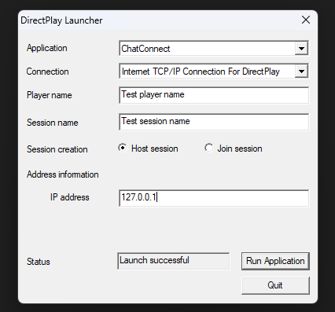
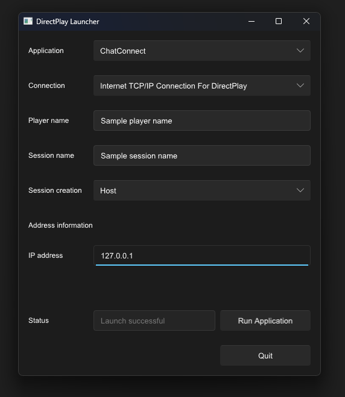
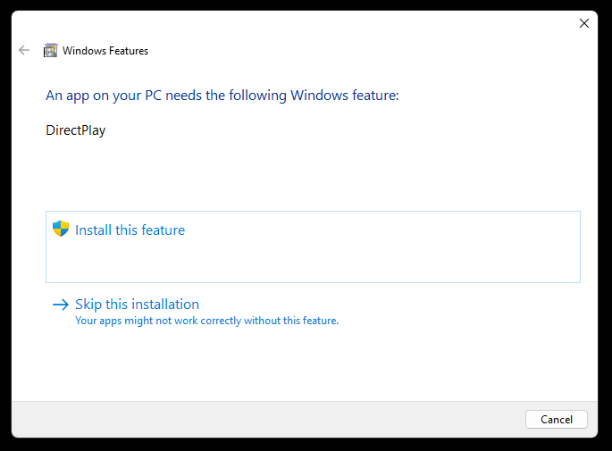

# DplayLobby Launcher Emulator
A rewrite of the DirectPlay Launcher included in the DirectX 7 SDK in Rust.
Also partial implementation of a DirectPlayLobby3A and DirectPlay4A wrapper, which can be easily extended for other needs.

# Comparison
Functionality wise, the new launcher should be able to do everything the old did.

Appearance:

Old launcher | New Launcher
:-----------:|:-----------:
 | 

# How to run
If you've never opened a DirectPlay application in your system, chances are it's not installed.

Good thing is Windows takes care of that automatically, so upon opening the application, you'll see this screen:

Just click `Install this feature` and Windows will take care of that automatically. After installing you might need to re open the screen.

If you do have DirectPlay installed, it's just as easy as double clicking the executable.

# Issues
Functionality wise, this should do everything that the SDK version does, from what I tested, but if you notice any problems report them!

Code wise I'm mostly happy with how this turned out, but if you have some suggestions on how to improve this, open a PR or an issue!

I'd mainly like to be able to not have duplicated data between Rust and the Slint framework (what drives the GUI), as currently it has a type different enough that I can't just pass it as a mutable reference (or maybe I can, and just haven't figured that out).

# How to compile
- Install Rust from [here](https://www.rust-lang.org/tools/install).
  - When installing, select option 1 (to install through the VS Community Installer)
  - Then, option 2 to customize installation, and set the following values
    - Default host triple: `i686-pc-windows-msvc`
    - Default toolchain: `stable`
    - Profile: leave default
    - Path variable: Y
- In a terminal, navigate to the project folder, and run the following:
  - `cargo build --release`
- This should output the created `dplay_lobby_emulator.exe` to the `\target\i686-pc-windows-msvc\release` folder on the project root.

# Technologies used
- [Slint](https://slint.dev/): for GUI
- [windows-rs](https://github.com/microsoft/windows-rs): for interacting with the Windows API
- [winres](https://github.com/mxre/winres): for embedding the icon on the executable

# Why in Rust?
Wanted to write something in Rust other than an Hello World app, and this seemed challenging enough.